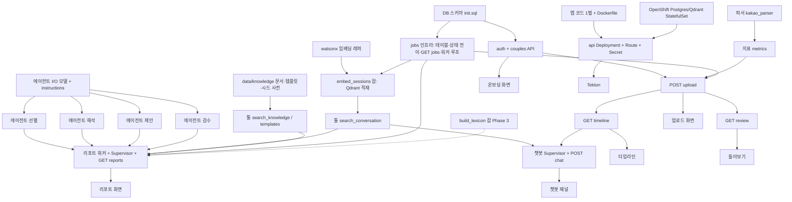

# 커플 대화 리포트 — 구현 계획 (TASKS.md)

> 상태: v0.1 · 기준: REQUIREMENTS, API_SPEC, TEST_CASES, 기획서 §10
> 해커톤 기간 가정: **3일**. Day 0 = 착수 전(오늘).

## 0. 공통 원칙

- **계약 우선**: API_SPEC이 프론트·백 사이의 계약. 바꿀 땐 문서 먼저 고치고 양쪽에 알린다
- **결정론 코드 → 에이전트 순**: 파서·지표가 돌아야 에이전트 입력이 생긴다. 에이전트는 Mock LLM으로 흐름을 먼저 연결하고 실제 LLM은 마지막
- **TDD 안 함**: TEST_CASES는 "완료 기준표"다. 구현 후 핵심 TC만 골라 확인하고, 자동화는 파서·지표처럼 순수 함수인 것만. 나머지는 수동 체크리스트로 써도 된다
- **Mock 모드 유지**: `USE_MOCK=true`로 전 흐름이 항상 돌아가게. 데모 백업이자 프론트 개발용 고정 응답
- **템플릿 포크**: `academic-complaint-multi-agent` 구조(`api/app/{agents,services,routers,models}`) 유지. 기존 테스트 패턴 따름
- **경계 규칙**: 컴포넌트에서 직접 fetch 금지(`src/api/client.ts` 경유). 에이전트가 DB에 직접 쓰지 않음(툴 경유). LLM이 숫자를 계산하지 않음

---

## 1. 의존성 그래프

**병렬 가능 묶음** (서로 의존 없음):
- 파서·지표 테스트 / DB 스키마 / 지식 문서·템플릿·시드 사전 / 임베딩 래퍼 / OpenShift StatefulSet / 프론트 공통 UI·Mock 기반 화면
- 에이전트 4개는 I/O 모델(2-12)만 확정되면 **동시에** 구현 가능 — 런타임 순서(선별→해석→제안→검수)는 빌드 순서가 아님
- jobs 인프라(2-0)는 upload 보다 먼저. 리포트 워커는 그 위에 얹음

---

## 2. Phase 구성

| Phase | 시점 | 목표 | 완료 기준 |
|---|---|---|---|
| **0** | Day 0 (오늘) | 문서·계약·결정론 코드 | 이 문서 세트 공유, `kakao_parser.py`·`metrics.py` 팀 repo에 |
| **1** | Day 1 오전 | **실측 V1~V6** + 뼈대 | 검증 결과로 기획서 개정. 템플릿 포크 + DB + Mock 모드 `/health/ready` |
| **2** | Day 1 오후 | 결정론 경로 end-to-end | 업로드 → 타임라인이 실제 데이터로 동작 (LLM 없이) |
| **3** | Day 2 | 에이전트 + 리포트 | 리포트 플로우 Mock→실 LLM. 챗봇 동작 |
| **4** | Day 3 오전 | 통합 + 배포 | OpenShift에서 데모 시나리오 1회 완주 |
| **5** | Day 3 오후 | 발표 준비 | 데모 리허설 2회, Mock 백업 확인 |

---

## 3. Phase 0 — Day 0 (오늘)

| ID | 작업 | 담당 | 산출물 | 의존 |
|---|---|---|---|---|
| 0-1 | 기획서·API_SPEC·REQUIREMENTS·TEST_CASES·TASKS 팀 공유 | 해찬 | docs/ | — |
| 0-2 | `kakao_parser.py`, `metrics.py` repo 커밋 | 해찬 | api/app/services/ | — |
| 0-3 | 팀 공용 watsonx 프로젝트 생성, 5명 초대, API 키 발급 | 해찬 | .env (Git 제외) | — |
| 0-4 | Git repo 생성, 템플릿 포크, `.gitignore`에 `.env` | 윤석 | repo | — |
| 0-5 | ~~Android 카톡 샘플 확보~~ **완료** — 최신 앱은 PC 와 동일한 대괄호 형식으로 확인, 파서 반영 | 팀원 중 Android | tests/fixtures/kakao/android.txt(구 형식), android_new.txt(신 형식) | — |
| 0-6 | JSON 계약(API_SPEC §4.2) 검토·확정 | 형준 | API_SPEC v0.2 | 0-1 |

---

## 4. Phase 1 — Day 1 오전: 실측 + 뼈대

### 실측 (전원 분담, 오전 내 결과 공유)

| ID | 검증 | 담당 | 방법 | 산출물 |
|---|---|---|---|---|
| 1-V1 | e5 한국어 카톡 임베딩 품질 | 윤아 | 20문장 유사도 행렬 (`02-vector-db/_common.py` 재활용) | 유사 문장 쌍이 상위에 오는지 표 |
| 1-V2 | 세션 기준 30분 | 윤석 | `python metrics.py <커플파일> 15/30/60` | 세션 수 비교, 상수 확정 |
| 1-V3 | 지표(빈도수 등) ↔ 실제 관계 변화 | 형준 | 커플 3쌍 `metrics.py` 출력 + 당사자 대조 | 지표별 "움직임/무관" 판정 |
| 1-V4 | gpt-oss 한국어 해석 문장 | 윤아 | Prompt Lab에서 highlights 10회 | 품질 메모, 대안 모델 필요 여부 |
| 1-V5 | OpenShift 이미지 pull | 해찬 | `oc run` qdrant/postgres | 가능/불가 + 우회 |
| 1-V6 | 템플릿 Mock 모드 | 윤석 | 포크 후 `USE_MOCK=true` `/health/ready` | 동작 확인 |

### 뼈대

| ID | 작업 | 담당 | TC | 의존 |
|---|---|---|---|---|
| 1-1 | DB 스키마 (`postgres/init.sql`, 기획서 §6.1) + `models/domain.py` | 윤석 | — | 0-4 |
| 1-2 | 파서·지표 스모크 (`metrics.py` CLI로 실 파일 확인, 순수 함수라 최소 pytest 몇 개만) | 윤석 | TC-PARSE, TC-METRIC 일부 | 0-2 |
| 1-3 | Android 파서 regex 검증 | 윤석 | TC-PARSE-001-3 | 0-5 |
| 1-4 | 프론트 프로젝트 세팅 + `api/client.ts` + Mock 응답 fixture (API_SPEC 예시 JSON 그대로) | 시여 | — | 0-6 |
| 1-5 | 공통 UI: Button, Card, Modal, Badge(a/b 색) | 시여 | — | — |
| 1-6 | OpenShift: Postgres·Qdrant StatefulSet + PVC | 해찬 | — | 1-V5 |
| 1-7 | 지식 문서 출처 목록 확정 + 10개 수집 (`data/knowledge/interpretations`) | 윤아 | — | — |
| 1-8 | 감성 시드 사전 검수·보강 (`sentiment_seed.json`) + `prompts/lexicon.md` 초안 | 윤아 | TC-METRIC-007 | — |

---

## 5. Phase 2 — Day 1 오후: 결정론 경로 E2E

| ID | 작업 | 담당 | TC | 의존 |
|---|---|---|---|---|
| 2-0 | jobs 인프라: 테이블·상태 전이·`GET /jobs/{id}`·워커 루프 (DB 큐 `SKIP LOCKED`, `while True`+try/except, 재시작 시 running→queued) | 윤석 | TC-API-003-11 | 1-1 |
| 2-1 | auth (signup/login, JWT) | 윤석 | — | 1-1 |
| 2-2 | couples API (invite/join/confirm/me/delete) | 윤석 | TC-API-001, 002 | 2-1 |
| 2-3 | upload API 동기 구간 (파싱→중복제거→암호화 저장→세션→지표 upsert(`summary_hash`)→`weekly_terms` 집계(시드 사전)) + `embed_sessions`·`report_backfill` 잡 INSERT. 메모: CPU 구간 `asyncio.to_thread`, INSERT `executemany ON CONFLICT DO NOTHING` / PC·모바일 시각 분 단위 정규화 후 해시 (C5) | 윤석 | TC-API-003 (1~10) | 1-1, 1-2, 2-0 |
| 2-4 | timeline API (`summary.sentiment`·지표 `mine` 은 요청자 본인 것만 — `deps.current_member`) | 윤석 | TC-API-004, 005-11, 005-13 | 2-1, 2-3 |
| 2-5 | review API + notes API (지표 `mine` 은 요청자 것만 — `deps.current_member`) | 시여(백) | TC-API-006, 007 | 2-1, 2-3 |
| 2-6 | watsonx 임베딩 래퍼 (`passage:`/`query:`) + `embed_sessions` 잡 (Qdrant 컬렉션 A, point id `{session_id}:{chunk_idx}`) | 윤아 | — | 1-V1, 0-3, 2-0 |
| 2-7 | 온보딩 화면 (가입 → 초대 코드 → 수락 대기 → 수락) | 시여 | — | 1-4, 1-5 |
| 2-8 | 업로드 화면 (드롭 → 이름 매핑 → 진행률) | 시여 | — | 1-4 |
| 2-9 | 타임라인 화면 (Mock fixture로 먼저) | 시여 | — | 1-4 |
| 2-10 | api Deployment + Service + Route + Secret/ConfigMap (서비스명 `couple-report-api`). 메모: 이미지에 `data/` 포함됨(빌드 컨텍스트 = repo 루트, ISSUE A6) — Deployment 에 별도 볼륨 불필요 | 해찬 | — | 1-6 |
| 2-13 | ~~Instana agent 존재 확인~~ **완료 — 없음 확인됨 (ISSUE D3)**. `execution_trace`로 대체 | 해찬 | — | 1-V5 |
| 2-11 | 제안 템플릿 풀 20~30개 작성 (지표 5 × 방향; `initiation_*` 없음) | 윤아 | — | — |
| 2-12 | 에이전트 4개 instructions 초안 + 검수 규칙표 | 윤아 | — | 0-6 |

**Phase 2 완료 기준**: 실제 커플 파일 업로드 → 타임라인 그래프가 실 데이터로 뜸 (리포트 카드는 pending)

---

## 6. Phase 3 — Day 2: 에이전트 + 리포트 + 챗봇

| ID | 작업 | 담당 | TC | 의존 |
|---|---|---|---|---|
| 3-1 | ~~툴: search_conversation, get_metrics, get_report, search_knowledge(dict), get_suggestion_templates(dict)~~ **완료** — 해찬이 이어받음. 기준선은 조회 시점 계산(`metrics.metrics_from_stored`), 기간 검색은 청크 payload 시각으로 Qdrant 필터 (ISSUE C11) | ~~윤석~~ 해찬 | test_tools.py | 2-6, 2-4 |
| 3-1a | `build_lexicon` 잡 (`services/lexicon.py`): 빈도 상위 단어+예시 → LLM 분류·canonical → `couple_lexicon` append → `weekly_terms` 재집계. 옵션(C6): 표시 후보 문맥 검증 | 윤석 + 윤아(프롬프트) | TC-METRIC-007 | 1-8, 2-3 |
| 3-2 | 지식 문서·템플릿 작성 완료 (`data/knowledge`, 적재 없음 — 메모리 로드) | 윤아 | — | 2-11, 1-7 |
| 3-3 | 에이전트 1~4 구현 (**4개 병렬 가능** — I/O 모델은 2-12에서 확정. Mock LLM로 흐름 연결 → 실 LLM). 메모: 코드가 이상치·delta 상위 3 선별하면 select 호출 제거 가능 (C1, 윤석·윤아 합의) | 윤석 + 윤아 | TC-AGENT-001~004 (수동 확인) | 2-12, 3-1 |
| 3-4 | 리포트 플로우 Supervisor (execution_trace). 메모: 기준선 부족 주는 LLM 없이 즉시 `insufficient_baseline` | 윤석 | — | 3-3 |
| 3-5 | 리포트 워커 (`report_backfill`: 최신 주부터, `Semaphore(3)` 주차 병렬, `summary_hash` 변경 주차만) + reports API (`deps.current_member` 로 `mine` 투영) | 윤석 | TC-API-005 | 2-0, 2-1, 3-4 |
| 3-1b | 단어 횟수 검색 (`services/term_search.py` 저장소 연결 + `tools/count_term.py` + `term_count_cache` 무효화). **LLM 무관** — 감성 사전·build_lexicon 과 독립 | 윤석 | TC-API-008-11~17 | 2-3 |
| 3-6 | 챗봇 Supervisor + chat API. 메모: advice/other 는 regex 사전 분기, 나머지는 검색 먼저 후 1회 호출 (C4). 횟수 질문 → other (A3) | 윤아(프롬프트) + 윤석 | TC-AGENT-005, TC-API-008 | 3-1 |
| 3-7 | 실 LLM 전환 + `reasoning_effort: low` + 토큰 설정 | 윤아 | 스모크 | 3-3, 3-6 |
| 3-8 | 리포트 화면 (summary / highlights / suggestions / moments + **"활발한 시간" 카드 + "내 단어" 카드**) | 시여 | — | 2-9 |
| 3-9 | ~~돌아보기 화면 (구간 선택 → 지표 vs 기준선 → 메모)~~ **완료** — D4 타입 확정: 질문 비율·답장 시간은 `{couple, mine}`, 메시지 수는 커플 합산, baseline 최대 8주, 숫자 없는 코드 comment | 시여 | TC-API-006, 005-13 | 2-5 |
| 3-10 | 챗봇 패널 (인용 카드, 리다이렉트 표시) | 시여 | — | 3-6 |
| 3-11 | Tekton 파이프라인 연결. 메모: 빌드 태스크 `CONTEXT=.` / `DOCKERFILE=api/Dockerfile` — `data/knowledge` 때문에 루트가 컨텍스트다 (ISSUE A6). `CONTEXT=api` 로 두면 COPY 4줄이 전부 실패 | 해찬 | — | 2-10 |
| 3-12 | Qdrant `couple_id` 삭제 → couples DELETE에 연결 | 윤석 | TC-API-002-1 | 2-6 |

**Phase 3 완료 기준**: 업로드 → 전 주차 리포트 generated → 챗봇 사실 질문 인용 답변

---

## 7. Phase 4 — Day 3 오전: 통합 + 배포

| ID | 작업 | 담당 | TC |
|---|---|---|---|
| 4-1 | OpenShift 전체 배포, Route로 프론트 접근 | 해찬 | — |
| 4-2 | TC-INT-001~003 OpenShift 환경에서 실행 | 윤석 | TC-INT |
| 4-3 | 금지 표현 regex 전 리포트 스캔 | 윤아 | TC-API-005-9 |
| 4-4 | 데모 데이터 준비 (동의받은 커플 1쌍 또는 합성) | 형준 | — |
| 4-5 | Mock 모드 백업 경로 점검 | 윤석 | TC-API-008-10 |
| 4-6 | ~~Instana에서 트레이스 확인~~ **스킵 (ISSUE D3, agent 없음)**. `execution_trace` 조회로 TRD §9.1 질문 1~3 확인 | 해찬 + 윤석 | — |

---

## 8. Phase 5 — Day 3 오후: 발표

| ID | 작업 | 담당 |
|---|---|---|
| 5-1 | 데모 리허설 2회 (기획서 §9 시나리오) | 전원 |
| 5-2 | 슬라이드: 설계 원칙 P-1~5, 아키텍처, 실측 결과(V1~V6), 로드맵 | 형준 |
| 5-3 | "왜 이렇게 설계했나" Q&A 예상 답변 (판정 배제, 동의 구조, LLM/코드 경계, Orchestrate 미사용 이유) | 형준 + 해찬 |

---

## 9. 완료 기준 (Definition of Done)

- [ ] 파서·지표: PC·iOS·Android 실 파일 3종 파싱 성공, 지표 출력 확인
      (파서는 완료 — 4개 픽스처 통과. 지표 출력은 `upload.py` 스텁 해제 후 확인 필요)
- [ ] TC-INT-001~003 OpenShift에서 1회 완주 (이게 통과하면 API TC 대부분은 자동으로 커버됨)
- [ ] TC-API-008-4/5 (조언 요청 리다이렉트) 수동 확인
- [ ] 금지 표현 0건
- [ ] Mock 모드로 데모 시나리오 완주 가능
- [ ] `.env` Git 미포함, Secret 주입 확인

---

## 10. 역할별 첫날 순서 요약

| 담당 | Day 1 오전 | Day 1 오후 |
|---|---|---|
| 형준 (PM) | V3 커플 3쌍 대조 · API_SPEC 확정 | 데모 데이터 섭외 · 팀 블로커 정리 |
| 윤아 (Prompt) | V1 임베딩 · V4 LLM 한국어 · 지식 문서 출처 · 시드 사전 검수 | 임베딩 래퍼 + embed 잡 · 템플릿 풀 · instructions |
| 윤석 (AI) | V2 · V6 · DB · 파서/지표 테스트 | jobs 인프라 · auth · couples · upload · timeline |
| 시여 (Front/Back) | 프론트 세팅 · Mock fixture · 공통 UI | 온보딩 · 업로드 · 타임라인 · review/notes API |
| 해찬 (SRE) | V5 · StatefulSet | Deployment · Route · Secret |

---

## 11. 리스크 → 대응

| 리스크 | 신호 | 대응 |
|---|---|---|
| V1 실패 (임베딩 품질 낮음) | 유사 문장이 상위에 안 옴 | 청크를 세션→일 단위로 키움. 그래도 안 되면 챗봇을 `metric_query`/`report_query` 중심으로 축소 |
| V4 실패 (한국어 어색) | Prompt Lab 출력 부자연 | Llama 4 Maverick 비교. 최악엔 highlights 문구를 템플릿화 |
| V5 실패 (이미지 pull 불가) | ImagePullBackOff | 내부 레지스트리 push 또는 quay 미러 |
| 리포트 소급 생성 느림 | 25주 × 4단계 > 5분 | 동기 구간만 데모, 리포트는 최근 8주만 사전 생성 |
| 에이전트 출력 스키마 불안정 | JSON 파싱 실패 빈발 | 템플릿 `05` 모듈의 Pydantic 검증 + 재시도 패턴 적용 |
| Day 2 끝까지 실 LLM 미전환 | — | Mock 응답으로 데모. 발표에서 명시 |
