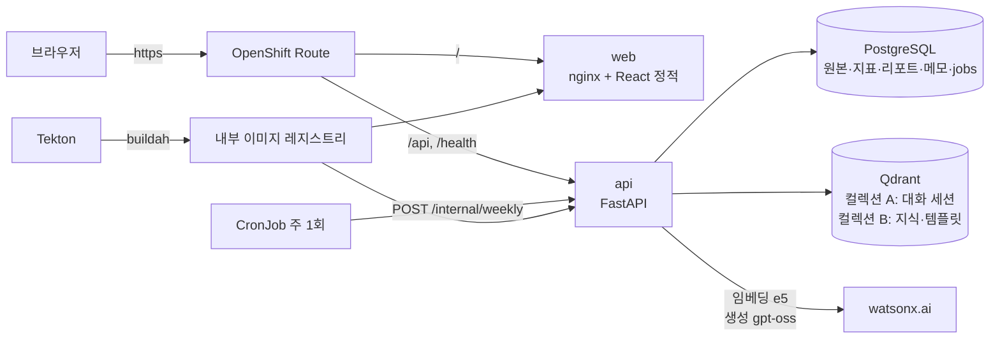

# 커플 대화 리포트 — 기술 설계 (TRD.md)

> 상태: v0.1 · 기준: 기획서 §5·§6, API_SPEC, SCAFFOLD
> 선택 기준: **3일 안에, 처음 하는 팀원도, 템플릿·실습에서 벗어나지 않게.**

## 1. 시스템 아키텍처

### 1.1 전체 구성



### 1.2 요청 경로 4종

| 경로 | 동기/비동기 | LLM | 설명 |
|---|---|---|---|
| 업로드 → 지표 | 동기 | ✗ | 파싱 → 중복 제거 → 암호화 저장 → 세션 → 전 주차 지표 upsert. 18k 메시지 < 10s |
| 리포트 생성 | **비동기** (jobs) | ✓ 4단계 | 주차별 선별→해석→제안→검수. Qdrant 적재도 여기서 |
| 타임라인·리포트·돌아보기 조회 | 동기 | ✗ | Postgres 읽기만 |
| 챗봇 | 동기 | ✓ 1~2회 | intent 분류 → 툴 → 답변. < 8s |

### 1.3 책임 경계 (P-2)

```
┌─────────────────────────────────────────────────────┐
│ 결정론 영역 (코드)                                    │
│  kakao_parser → metrics → outliers → weekly_metrics  │
│  crypto · dedup · sessions · jobs · repo(SQL)        │
└───────────────────────┬─────────────────────────────┘
                        │ 지표 JSON (§7.1) — 유일한 입력
┌───────────────────────▼─────────────────────────────┐
│ LLM 영역 (에이전트)                                   │
│  report_supervisor: select → interpret → suggest → safety │
│  chat_supervisor : intent → tool → answer(인용 강제)  │
│  ─ 툴 경유로만 읽기. DB 쓰기 없음. 숫자 계산 없음 ─    │
└───────────────────────┬─────────────────────────────┘
                        │ 리포트 JSON (§7.2) — Pydantic 검증
┌───────────────────────▼─────────────────────────────┐
│ 저장·노출 (코드)                                      │
│  reports 테이블 → API → React                        │
└─────────────────────────────────────────────────────┘
```

LLM 출력은 **Pydantic 검증 실패 시 1회 재요청, 2회 실패 시 해당 주 `status=failed`**. 데모가 멈추지 않도록 summary는 항상 코드가 채운다.

---

## 2. 기술 스택

### 2.1 백엔드 (api/)

| 영역 | 선택 | 버전 | 비고 |
|---|---|---|---|
| 프레임워크 | FastAPI + uvicorn | 템플릿 | `/docs` 자동 → 프론트 계약 확인 |
| 검증 | Pydantic v2 | 템플릿 | 요청/응답/LLM 출력 전부 |
| 설정 | pydantic-settings | 템플릿 | `.env` → `Settings` |
| DB | psycopg3 (pool) + 직접 SQL | 템플릿 | ORM 없음. `services/postgres_service.py`에 repo 함수 |
| 벡터 | qdrant-client | 템플릿 | 컬렉션 2개 |
| LLM/임베딩 | ibm-watsonx-ai | 템플릿 | `ai_service.py` 단일 진입점 |
| 재시도 | tenacity | 템플릿 | watsonx 호출·JSON 파싱 |
| 인증 | **pyjwt + passlib[bcrypt]** | 신규 | HS256, 24h 만료 |
| 암호화 | **cryptography (Fernet)** | 신규 | `messages.body_enc` |
| 업로드 | **python-multipart** | 신규 | 50MB 제한 |
| 작업 큐 | **asyncio.Queue + jobs 테이블** | 신규 | 워커 1개, 앱 내 |
| 테스트 | pytest (최소) | 템플릿 | 파서·지표·Mock 흐름 3파일 |

### 2.2 프론트 (web/)

| 영역 | 선택 | 이유 |
|---|---|---|
| 빌드 | **Vite + React 18 + TypeScript** | 설정 0 |
| 라우팅 | **React Router v6** | 화면 6개 |
| 서버 상태 | **TanStack Query v5** | 진행률 폴링 `refetchInterval`, 캐시 무효화(`reports` 키) |
| 클라이언트 상태 | **Context** (`AuthContext`: token, couple_id, me) | 셋뿐 |
| 스타일 | **Tailwind + shadcn/ui** | Button·Card·Dialog·Badge·Tabs·Progress 복붙 |
| 차트 | **Recharts** | `LineChart` + `ReferenceDot`(이상치 마커) + `Tooltip` |
| 폼 | **react-hook-form + zod** | 가입·이름 매핑·메모 |
| HTTP | `fetch` 래퍼 `api/client.ts` | 토큰 주입, 에러 → `{code, message}` 파싱, `VITE_USE_MOCK` 분기 |
| 파일 업로드 | `<input type=file>` + `FormData` | 라이브러리 불필요 |

### 2.3 인프라

| 영역 | 선택 |
|---|---|
| 컨테이너 | Docker, compose(로컬), OpenShift(배포) |
| 이미지 | api: python:3.12-slim (교육 안내 기준) / web: node:20 빌드 → nginx:alpine |
| 배포 | Deployment(api, web) · StatefulSet(postgres, qdrant) · Route(edge TLS) · Secret · ConfigMap · CronJob |
| CI/CD | Tekton (git-clone → buildah → apply → set image), Git push 트리거 |
| 로그 | 표준 logging JSON → stdout, `trace_id` 포함 |
| 관측성 | **Instana** (Python 자동 계측 + OpenTelemetry 스팬) — §9.1 |

### 2.4 의도적으로 제외

Redis · Celery · ORM · Next.js/SSR · OAuth·카카오 로그인 · Alembic · Orchestrate 네이티브 체인

---

## 3. 프로젝트 구조

SCAFFOLD.md §2 참조. 핵심 계층:

```
routers/   →  services/   →  (postgres | qdrant | ai_service)
   ↓              ↑
models/api    tools/  ←  agents/  ←  prompts/
```

- `routers`는 검증·인증·에러 매핑만. 로직은 `services`
- `agents`는 `tools`만 호출. `services`·DB 직접 접근 금지
- `tools`는 얇은 래퍼: `services` 함수 호출 + 에이전트용 포맷

---

## 4. 데이터 계층

### 4.1 PostgreSQL

스키마: 기획서 §6.1 + 다음 추가

```sql
CREATE TABLE jobs (
    job_id       UUID PRIMARY KEY DEFAULT gen_random_uuid(),
    couple_id    UUID NOT NULL REFERENCES couples(couple_id) ON DELETE CASCADE,
    kind         VARCHAR(30) NOT NULL,          -- report_backfill | report_single
    status       VARCHAR(20) NOT NULL DEFAULT 'queued'
                 CHECK (status IN ('queued','running','done','failed')),
    total        INTEGER NOT NULL DEFAULT 0,
    done         INTEGER NOT NULL DEFAULT 0,
    failed       INTEGER NOT NULL DEFAULT 0,
    current_week DATE,
    error        TEXT,
    created_at   TIMESTAMPTZ NOT NULL DEFAULT now(),
    updated_at   TIMESTAMPTZ NOT NULL DEFAULT now()
);
```

**암호화**: `body_enc = Fernet(key).encrypt(body.encode())`. 복호화는 (a) 리포트 evidence 발췌 (b) 챗봇 인용 snippet (c) Qdrant 적재 시 임베딩 입력 — 세 곳만. 지표 계산은 `body_len`·`is_question`(저장 시 계산)으로 복호화 없이.

**삭제**: `DELETE couples` → CASCADE + `qdrant.delete(filter couple_id)` 를 같은 트랜잭션 핸들러에서.

### 4.2 Qdrant

| 컬렉션 | 벡터 | 포인트 단위 | payload | 필터 |
|---|---|---|---|---|
| `couple_sessions` | e5 1024 cosine | 세션 (≤30 msg, 초과 시 분할) | `couple_id, session_id, chunk_idx, started_at(epoch), ended_at, participants, msg_count` — **본문 없음** | `couple_id` 필수, `started_at` 범위 |
| `knowledge` | e5 1024 cosine | 문서 섹션 / 템플릿 1개 | `doc_type(interpretation\|suggestion_template), metric, direction, source, text, template_id?` | `doc_type, metric, direction` |

임베딩 입력: 세션 청크는 `"passage: " + "\n".join(f"{sender}: {body}")`, 질문은 `"query: " + text`.

### 4.3 작업 큐

```
POST /upload ──► jobs INSERT(queued, total=N) ──► asyncio.Queue.put(job_id)
                                                        │
worker (앱 시작 시 1개) ◄───────────────────────────────┘
  for week in weeks:
     report_supervisor.run(week) → reports UPSERT → jobs.done += 1
     실패 시 reports.status=failed, jobs.failed += 1, 계속
  jobs.status = done
```

앱 재시작 시 `queued/running` 잡을 다시 큐에 넣는다(간단 복구). 워커 1개라 동시성 문제 없음.

---

## 5. 에이전트 계층

### 5.1 공통 (`agents/base.py`)

```python
class Agent:
    name: str
    prompt_file: str            # prompts/<name>.md
    output_model: type[BaseModel]

    async def run(self, input: BaseModel, trace: Trace) -> output_model:
        prompt = render(self.prompt_file, input)
        for attempt in (1, 2):
            raw = await ai.generate(prompt, reasoning_effort="low", max_tokens=2000)
            try:
                out = self.output_model.model_validate_json(strip_fences(raw))
                trace.add(self.name, input, out, attempt)
                return out
            except ValidationError as e:
                trace.add_error(self.name, raw, e)
        raise AgentOutputError(self.name)
```

Mock 모드: `ai.generate`가 `mock/<name>.json`을 반환.

### 5.2 리포트 플로우

```
weekly_metrics(week) + notes(week) + events(week)
  │
  ▼ select_agent      → SelectOut {candidates:[{metric, who, delta|outlier_ref, reason}]}  ≤3
  ▼ interpret_agent   → for each: tools.search_knowledge(metric, direction)
  │                               tools.search_conversation(couple, week range, metric 키워드)
  │                     → InterpretOut {highlights:[{observation, interpretations≥2, evidence, sources}]}
  ▼ suggest_agent     → tools.get_suggestion_templates(metric, direction)
  │                     → SuggestOut {suggestions:[{linked_highlight, template_id, text}]}  ≤2
  ▼ safety_agent      → banned_patterns.txt regex 사전 검사 → 걸린 문장만 LLM 재작성
  │                     → SafetyOut {passed, rewritten:[{before, after}]}
  ▼ Report(§7.2) 조립 (summary·metrics·moments는 코드가 채움) → Pydantic 검증 → UPSERT
```

**검수 2단**: regex가 먼저(결정론, 빠름) → 걸린 것만 LLM. 금지 표현 대부분은 regex로 잡힌다.

### 5.3 챗봇

```
message + focus_range + history
  │
  ▼ intent (LLM, 출력 {intent}) → 허용 집합 밖이면 "other"로 재매핑 (템플릿 패턴)
  ├─ advice_request → 고정 문구 반환 (LLM 호출 없음)
  ├─ other          → 안내 문구
  ├─ metric_query   → tools.get_metrics → 답변 생성
  ├─ report_query   → tools.get_report  → 답변 생성
  └─ fact_query     → tools.search_conversation(k=8, focus_range 가중) 
                        → 결과 0 → "관련 기록을 찾지 못했어요"
                        → 답변 생성 (인용 필수 지시) → citations 비면 폐기·대체
```

---

## 6. 프론트 아키텍처

### 6.1 라우트

| 경로 | 페이지 | 가드 |
|---|---|---|
| `/login`, `/signup` | Auth | — |
| `/onboarding` | Onboarding | 로그인 + couple 없음/미완료 |
| `/` | Timeline | couple active |
| `/upload` | Upload | active |
| `/reports/:week` | Report | active |
| `/review` (`?session=` 또는 `?start=&end=`) | Review | active |
| `/settings` | Settings | 로그인 |

가드는 `GET /api/couples/me` 한 번으로 분기 (`AuthContext`에 캐시).

### 6.2 데이터 흐름

```
client.ts ──► TanStack Query
   useTimeline()           GET timeline, staleTime 30s
   useReport(week)         GET reports/{week}, status=pending이면 refetchInterval 3s
   useJob(jobId)           GET jobs/{id}, done 전까지 refetchInterval 2s → 완료 시 timeline·reports 무효화
   useReview(params)       GET review
   useChat()               POST chat (mutation), history는 컴포넌트 state
   useNotes()              POST/DELETE (mutation) → review 무효화
```

### 6.3 a/b 표시

API는 `"a"/"b"`만 준다. `lib/names.ts`의 `who(x)`가 `me`면 "나", 아니면 상대 `display_name`. 리포트 본문의 "A"/"B" 문자열은 서버가 생성 시 이미 치환하지 않으므로 **프론트가 렌더 직전에 치환** (`replaceNames(text, members)`).

### 6.4 Mock

`VITE_USE_MOCK=true`면 `client.ts`가 `api/mock/*.json`을 반환. 백엔드 없이 화면 개발 가능. JSON은 API_SPEC 예시와 동일 파일.

---

## 7. 보안·데이터

| 항목 | 구현 |
|---|---|
| 인증 | JWT Bearer. 모든 couple 리소스는 `assert user in (user_a, user_b)` |
| 본문 | Fernet 암호화. 키 `ENCRYPTION_KEY` Secret |
| LLM 전달 최소화 | 해석 evidence는 선별된 주의 세션 ≤3개, 챗봇은 top-k 8개 청크만 |
| Qdrant | payload에 본문 없음. 인용 snippet은 Postgres에서 복호화 |
| 삭제 | couples DELETE → CASCADE + Qdrant 필터 삭제. 동기 |
| 비밀 | `.env` Git 제외, OpenShift Secret `envFrom` |
| CORS | `ALLOWED_ORIGINS` 화이트리스트 |

---

## 8. 배포

### 8.1 OpenShift 리소스

| 파일 | 리소스 | 출처 |
|---|---|---|
| 00 | Secret(`WATSONX_API_KEY, JWT_SECRET, ENCRYPTION_KEY, POSTGRES_PASSWORD`) + ConfigMap(나머지 env) | 신규 |
| 10 | postgres StatefulSet + headless Service + PVC 5Gi | 실습 10·12 |
| 11 | qdrant StatefulSet + Service + PVC 5Gi | 실습 10 |
| 20 | api Deployment(replicas 1, `envFrom` Secret+ConfigMap, readiness `/health/ready`) + Service | 실습 06·07 |
| 21 | Route edge TLS, path `/api` `/health` → api | 실습 08 |
| 30/31 | web Deployment + Service + Route `/` | 실습 06~08 |
| 40 | CronJob `0 3 * * 1` → `curl -X POST api/internal/weekly -H "X-Internal-Key"` | 신규 |
| tekton/ | Pipeline(git-clone → buildah api → buildah web → apply → set image) + Trigger | 실습 CI/CD |

`replicas: 1` 고정 — 인프로세스 작업 큐 때문. 늘리려면 큐를 Redis로 (로드맵).

### 8.2 환경별 설정

| | 로컬 | OpenShift |
|---|---|---|
| AI_PROVIDER | mock → watsonx | watsonx (Mock은 데모 백업 스위치) |
| DSN | `postgres:5432` (compose) | `postgres.<ns>.svc:5432` |
| QDRANT_URL | `http://qdrant:6333` | `http://qdrant.<ns>.svc:6333` |
| 프론트 API base | `http://localhost:8000` | 같은 Route `/api` (상대 경로) |

---

## 9. 비기능 대응

| NFR | 구현 |
|---|---|
| 001 성능 | 지표 계산은 순수 Python, 18k 메시지 ~2s. 리포트 조회는 JSONB 단일 행 |
| 002 비동기 | §4.3 |
| 003 Mock | `AI_PROVIDER=mock` → ai_service·agents 전부 고정 응답 |
| 004 데이터 보호 | §7 |
| 005 관측성 | `reports.execution_trace` JSONB + `trace_id` + Instana 트레이스 (§9.1) |
| 007 한국어 | 모든 prompts 첫 줄 + `lang=ko` 검증(한글 비율 < 50%면 재요청) |
| 008 확장 | `metrics.py` 함수 추가 + `summary` 키 추가. select 프롬프트는 키를 나열하지 않음 |

### 9.1 관측성 — Instana

개발 완료 후 Instana로 리뷰한다. **자동 계측만으로는 에이전트 단계가 안 보이므로** 아래는 스캐폴딩 단계에서 넣는다.

| 항목 | 구현 | 비용 |
|---|---|---|
| 자동 계측 | `pip install instana`, env `AUTOWRAPT_BOOTSTRAP=instana`, `INSTANA_AGENT_HOST` | FastAPI·psycopg·httpx(Qdrant) 자동 |
| 에이전트 스팬 | `agents/base.py` `run()` 을 `tracer.start_as_current_span(f"agent.{name}")`로 감쌈. 속성: `attempt`, `output_valid` | 3줄 |
| LLM 스팬 | `ai_service.generate/embed` 를 `span("watsonx.generate")`로. 속성: `model`, `reasoning_effort`, `input_chars`, `output_chars` | 5줄 |
| 툴 스팬 | `tools/*` 각 함수 `span(f"tool.{name}")`. 속성: `k`, `hits` | 데코레이터 1개 |
| 작업 큐 스팬 | `jobs` 워커의 주차 루프 `span("report.week", week_start)` | 1줄 |
| 로그 연결 | logging 포맷에 `trace_id=%(otelTraceID)s` | 포맷 1줄 |
| 프론트 EUM | `web/index.html` Instana EUM 스니펫 (선택) | 스니펫 |
| OpenShift | Instana agent DaemonSet — 해커톤 환경 기확인 필요 | 해찬 |

**리뷰 때 확인할 질문** (계측이 이걸 답할 수 있어야 함)
1. 리포트 1주 생성 시 LLM 4단계 중 병목은 어디인가 (`agent.*` 스팬 비교)
2. 챗봇 p95 < 8s (NFR-001) — `POST /chat` 분포, `tool.search_conversation` 비중
3. 업로드 동기 구간 < 10s — `POST /upload` 중 `metrics` 스팬
4. 소급 생성 25주 동안 Postgres 풀·Qdrant 지연 추이
5. watsonx 호출 실패율·재시도율 (`attempt=2` 비율)

스팬 이름 규약: `agent.<name>` / `tool.<name>` / `watsonx.<op>` / `report.week` / `job.<kind>`.

---

## 10. 로드맵 시 바뀌는 것

| 기능 | 변경 |
|---|---|
| 분석 단위 선택 (일/주/월) | `metrics._bucket(unit)`, `timeline?unit=`, 기준선 상수 단위별. 리포트는 주 고정 |
| 콕 찌르기 Lv.2 | `pokes` 테이블 + `POST /pokes`, 알림은 폴링 |
| 2층 AI 지표 | `classify_agent` 파서 뒤 추가, 결과 `summary`에 합류 |
| 다중 워커 | asyncio 큐 → Redis + RQ, `replicas > 1` |
| Orchestrate 접점 | FastAPI `/openapi.json`을 툴로 등록, 챗봇 에이전트만 노출 |
